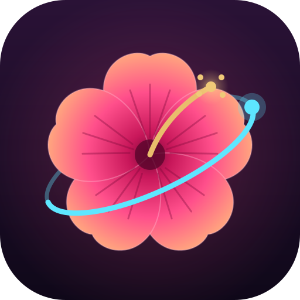

  

# Hibiscus

Hibiscus is a custom operating system for standalone VR headsets, built
on LineageOS 17.1 (Android 10). The idea is one OS that runs on hardware
from different vendors, with the device-specific drivers kept separate so
porting to a new headset stays manageable.

The Pico Neo 2 is the first supported device and where all development
happens today. Other headsets, like the Oculus Quest 1 and Pico Neo 3, are
planned once the OS is split from the drivers.

**This is an early work in progress, not a finished product.** On the Neo 2
the system boots, audio works, and the VR home launches and renders on the
headset display with head tracking. Controllers, 6DoF tracking and
passthrough still don't work.

## Before you install

Installing Hibiscus means flashing new software onto your headset. The
guides currently cover the Pico Neo 2. Follow them exactly: writing the
wrong partition, or a bootloader older than the device allows, can
permanently brick the headset. A way back to the stock software is covered
in the docs as well.

## Getting started

Everything you need is in the docs:

- Requirements and what to expect
- Building the image
- Flashing it to the headset
- First boot setup
- Restoring the stock software

Read them on the [project site](https://hibiscusxr-37c6a7.gitlab.io/docs/)
or in this repository under [`websites/docs/`](websites/docs/).

## Links

- Project site: https://hibiscusxr-37c6a7.gitlab.io/
