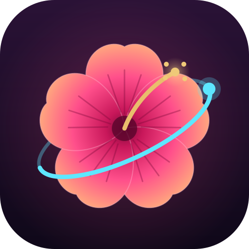

  

# Hibiscus

Hibiscus is a custom operating system for standalone VR headsets, built
on LineageOS 17.1 (Android 10). The idea is one OS that runs on hardware
from different vendors, with the device-specific drivers kept separate so
porting to a new headset stays manageable.

The Pico Neo 2 is the first supported device and where all development
happens today. Other headsets, like the Oculus Quest 1 and Pico Neo 3, are
planned once the OS is split from the drivers.

**This is an early work in progress, not a finished product.** The tables
below show what works on each headset.

## Device compatibility

| Headset | Status |
| --- | --- |
| Pico Neo 2 | Supported, in development |
| Oculus Quest 1 | Planned |
| Pico Neo 3 | Planned |

### Pico Neo 2

| Feature | Status |
| --- | --- |
| Boot, 3840x2160 display | Working |
| Audio | Working |
| Suspend and resume | Working |
| Head tracking | Working, 3DoF and 6DoF SLAM |
| VR compositor | Working, async TimeWarp direct present |
| 2D Pico apps | Working |
| Controllers | Partial: pairing, buttons and battery work, no positional tracking |
| Passthrough | Not working |
| Software IPD adjustment | Working |
| Wireless adb | Working, opt-in |
| Setup wizard | Broken, disabled automatically on first boot |

## Before you install

Installing Hibiscus means flashing new software onto your headset. The
guide currently covers the Pico Neo 2. Follow it exactly: writing the
wrong partition, or a bootloader older than the device allows, can
permanently brick the headset. Backing up the stock software first is
covered in the guide as well.

## Getting started

The flashing guide lives on the
[project site](https://hibiscusxr-37c6a7.gitlab.io/#/flashdocs).

## Links

- Project site: https://hibiscusxr-37c6a7.gitlab.io/
