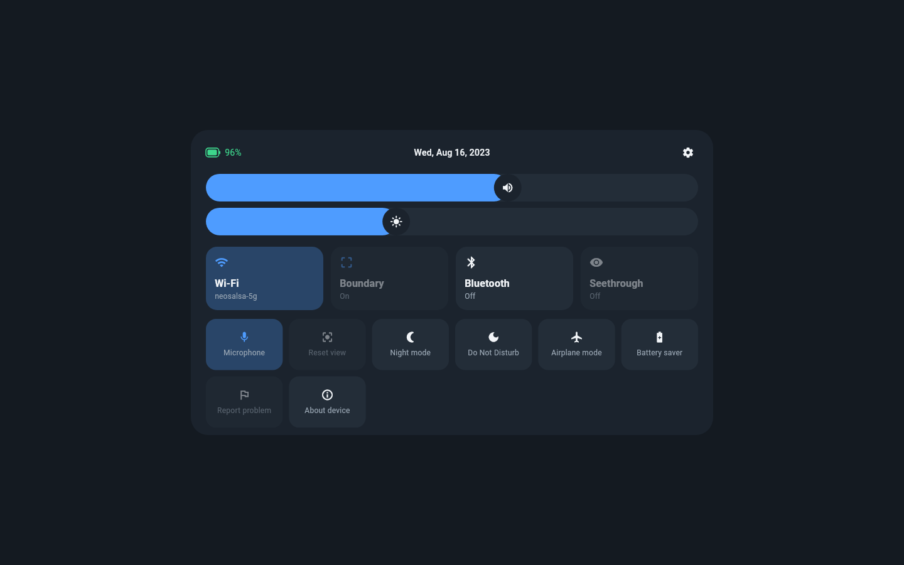
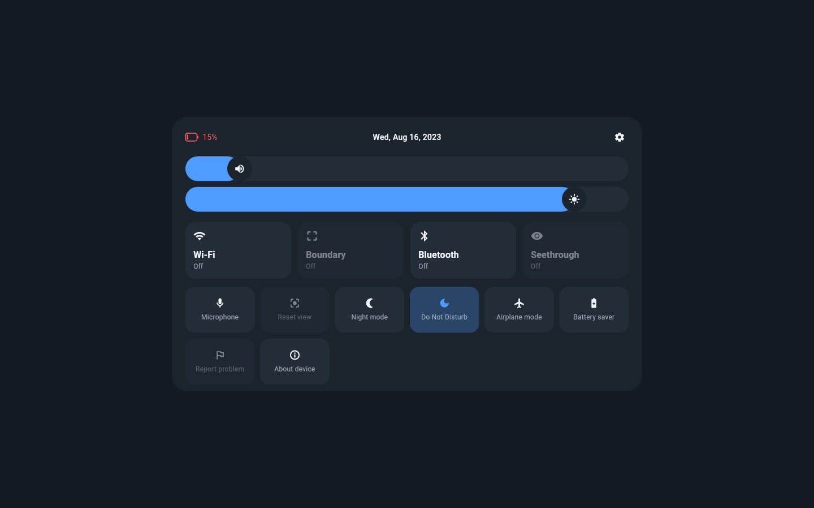

# quick-panel

Quick settings panel for the Pico Neo 2 running the LineageOS 17.1 port.

## Screenshots

| Panel | Radios off |
|---|---|
|  |  |

## Features

- Status bar: battery level, live date, settings shortcut
- Volume and brightness sliders, wired to AudioManager and
  Settings.System
- Large tiles: Wi-Fi (with SSID), Boundary, Bluetooth, Seethrough
- Small tiles: Microphone, Reset view, Night mode, Do Not Disturb,
  Airplane mode, Battery saver, Report problem, About device
- Radio toggles that cannot be flipped programmatically on Android 10+
  open the matching system panel instead
- Pico-side toggles (seethrough, boundary) broadcast a seam intent for
  the OS layer to catch
- Tiles without a platform implementation yet are greyed out and inert
- D-pad/controller navigation: arrows move focus, confirm activates

## Build and test

```sh
flutter pub get
flutter gen-l10n
flutter test
flutter analyze
flutter build apk --release   # debug-signed, re-sign before distributing
```

## License

AGPL-3.0, see `LICENSE`.
