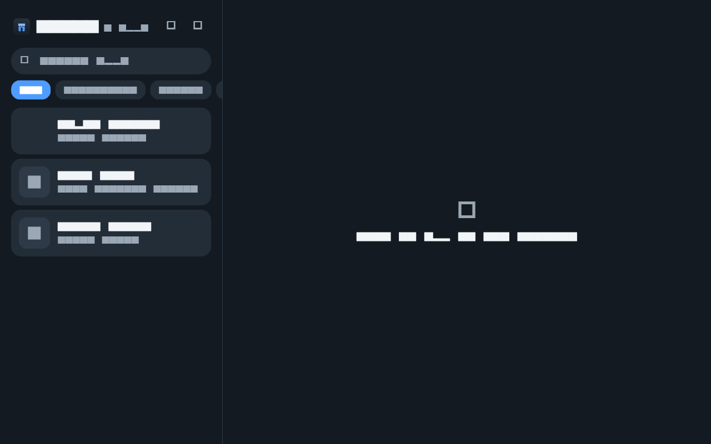
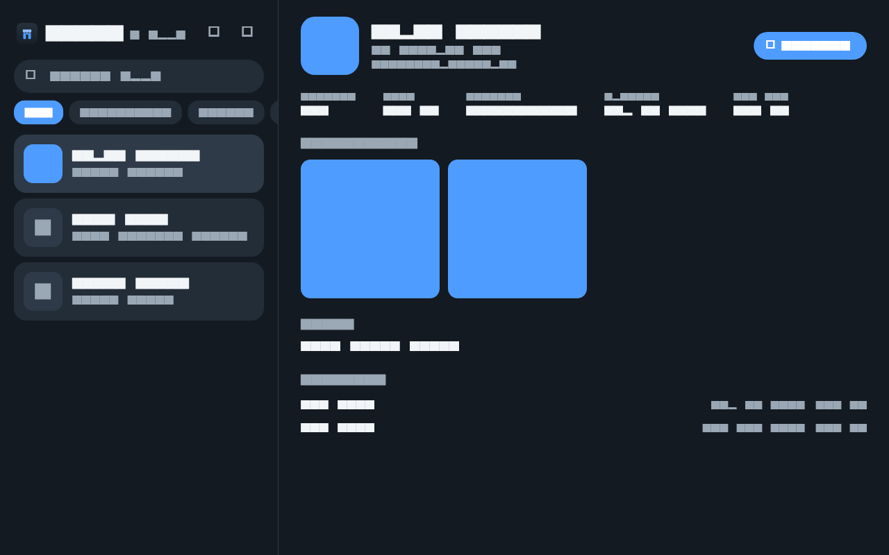
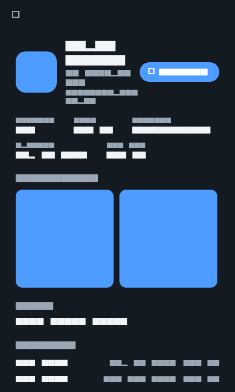

# Store

The Hibiscus app store. Browses, searches and installs packages from any
F-Droid compatible repository - `https://f-droid.org/repo` out of the box,
with a self-hosted address one settings sheet away.

| catalog | app page | compact |
| --- | --- | --- |
|  |  |  |

## How it works

- The catalog comes from the repo's `index-v2.json`. Names, descriptions,
  icons and screenshots are localized fields; the app picks `en-US` and
  falls back to whatever the repo ships.
- Downloads stream into the app cache and install through
  `PackageInstaller`. Signed into the system image it holds
  `INSTALL_PACKAGES`, so installs are silent; sideloaded debug builds fall
  back to the system confirm dialog.
- The repository URL persists in SharedPreferences. Point it at the home
  server once it exists - the app only needs an F-Droid `index-v2.json`
  over http(s).

## Development

```
flutter pub get
flutter analyze
flutter test
```

Goldens regenerate with `flutter test test/golden --update-goldens`.
