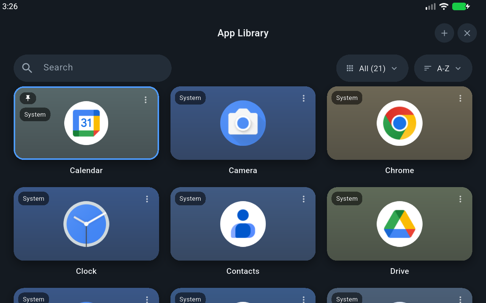
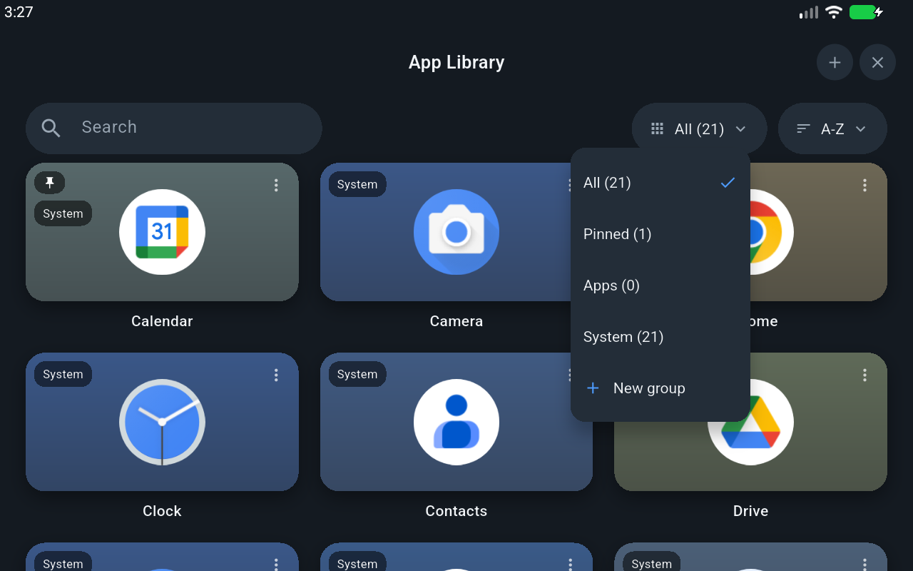
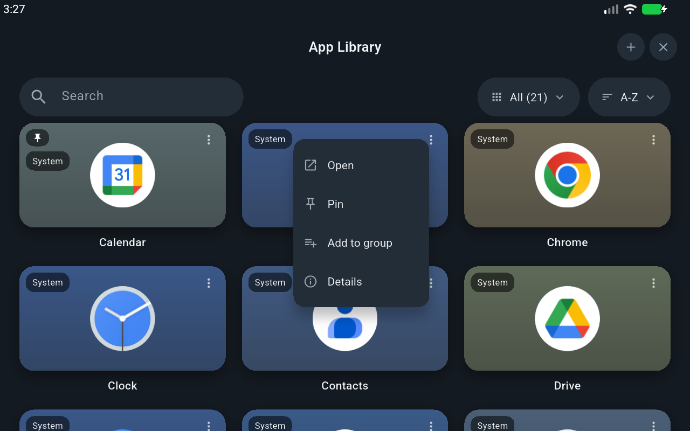

# library

App library for the Pico Neo 2 running the LineageOS 17.1 port - a
Quest-style dark grid of every launchable app, built in Flutter. It is
meant to run inside the `vrhome` shell as the app window, but works as a
normal launcher-style activity anywhere.

## Screenshots

| Grid | Collections | Tile menu |
|---|---|---|
|  |  |  |

## Features

- Tile grid of installed apps with icons, icon-tinted backdrops and
  labels
- Search with accent-insensitive matching
- Collections: All / Pinned / Apps / System plus user groups, with counts
- Sort: A-Z, Z-A, recently installed, recently updated, custom order
- Pin apps to the top, long-press-drag to rearrange
- Groups: create, rename, delete, add/remove members
- Tile menu: open, pin, add to group, details, uninstall (user apps)
- Install APKs through the system file picker
- D-pad/controller navigation: arrows move focus, confirm launches,
  menu key opens the tile menu
- Live updates when packages are installed or removed
- All UI strings in ARB files, ready for localization

## Layout

```
lib/
  main.dart                  wiring only
  l10n/                      ARB strings
  src/
    models.dart              AppEntry / AppGroup (pure)
    text_norm.dart           search normalization
    library_store.dart       catalog + pins + groups + order + filters
    menu_actions.dart        which menu items each tile gets
    persistence.dart         snapshot + storage interface
    library_controller.dart  source<->store glue, load state, icon cache
    platform/
      app_source.dart            platform abstraction
      android_app_source.dart    MethodChannel/EventChannel glue
      fake_app_source.dart       in-memory source for tests
      prefs_persistence.dart     SharedPreferences snapshot
      icon_cache.dart            icon byte memoizer
    ui/
      theme.dart             colors + ThemeData
      icon_colors.dart       dominant icon color + tile gradient
      library_page.dart      window: header, controls, states
      controls.dart          search field + dropdown pills
      app_grid.dart          grid + drag/drop reorder + d-pad
      app_tile.dart          one tile: icon, badges, kebab
      menus.dart             context menu + dialogs
android/                   MethodChannel side (Kotlin, thin glue)
```

All decisions live in `src/` pure Dart and are covered by `test/`. The
Kotlin side only queries PackageManager, rasterizes icons and fires
intents.

## Build and test

```sh
flutter pub get
flutter gen-l10n
flutter test
flutter analyze
flutter build apk --release   # signed with debug.keystore
```

`debug.keystore` is a committed throwaway key, same convention as the
other repos in this workspace - swap in a real key before distributing.

## License

AGPL-3.0, see `LICENSE`.
