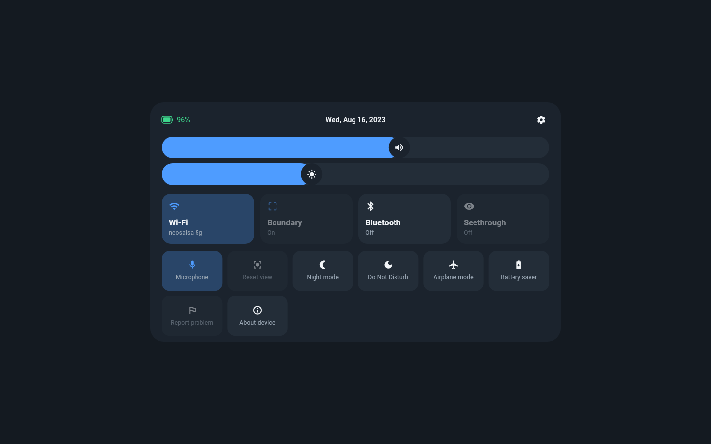
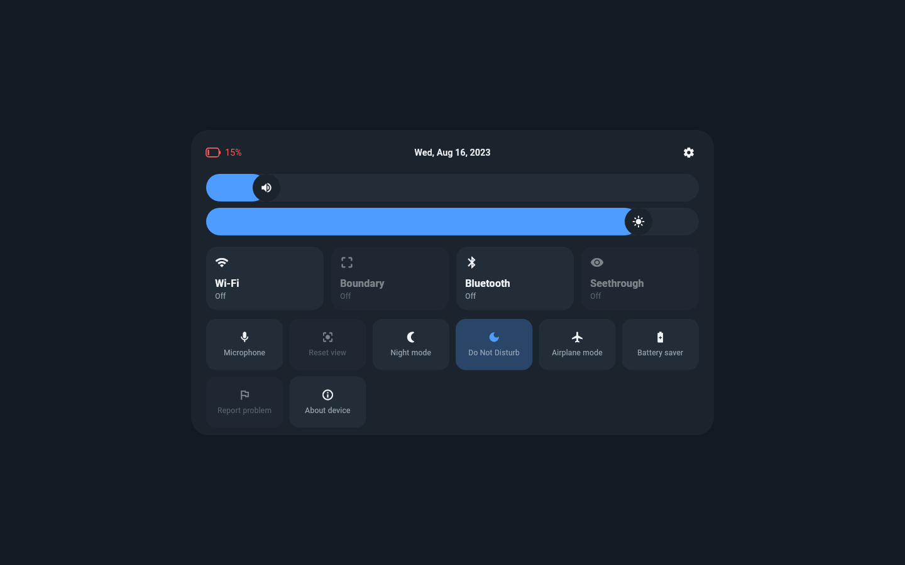

# quick-panel

Quick settings panel for the Pico Neo 2 running the LineageOS 17.1 port -
a Quest-style dark panel with radios, volume and brightness, built in
Flutter. It is meant to run inside the `vrhome` shell as a floating
window, but works as a normal activity anywhere.

## Screenshots

| Panel | Radios off |
|---|---|
|  |  |

## Features

- Status bar: battery level, live date, settings shortcut
- Volume and brightness sliders, wired to AudioManager and
  Settings.System
- Large tiles: Wi-Fi (with SSID), Boundary, Bluetooth, Seethrough
- Small tiles: Microphone, Reset view, Night mode, Do Not Disturb,
  Airplane mode, Battery saver, Report problem, About device
- Radio toggles that cannot be flipped programmatically on Android 10+
  open the matching system panel instead
- Pico-side toggles (seethrough, boundary) broadcast a seam intent for
  the OS layer to catch
- Tiles without a platform implementation yet are greyed out and inert
- D-pad/controller navigation: arrows move focus, confirm activates
- All UI strings in ARB files, ready for localization

## Layout

```
lib/
  main.dart                    wiring only
  l10n/                        ARB strings + generated localizations
  src/
    models.dart                ToggleId / ActionId / SettingsSnapshot
    catalog.dart               tile order, icons, large vs small
    labels.dart                tile + subtitle string resolution
    settings_store.dart        all panel state (pure)
    settings_controller.dart   source<->store glue
    persistence.dart           snapshot + storage interface
    platform/
      settings_source.dart         platform abstraction
      android_settings_source.dart MethodChannel/EventChannel glue
      fake_settings_source.dart    in-memory source for tests
      prefs_persistence.dart       SharedPreferences snapshot
    ui/
      theme.dart               colors + ThemeData
      quick_settings_page.dart panel: status bar, sliders, tiles, footer
      status_bar.dart          battery + date + settings gear
      panel_slider.dart        pill slider with icon knob
      tiles.dart               large/small setting tiles
android/                     MethodChannel side (Kotlin, thin glue)
tool/make_icon.py            launcher icon generator (PIL)
```

All decisions live in `src/` pure Dart and are covered by `test/`. The
Kotlin side only reads system services and fires intents/broadcasts.

## Build and test

```sh
flutter pub get
flutter gen-l10n
flutter test
flutter analyze
flutter build apk --release   # debug-signed, re-sign before distributing
```

Golden screenshots are refreshed with
`flutter test test/golden --update-goldens`. The README screenshots come
from `test/golden/screenshot_test.dart`, which loads the Roboto and
MaterialIcons fonts bundled with the Flutter SDK (`$FLUTTER_ROOT`).

No signing key is committed. Configure a real release key via
`key.properties` / `signingConfigs` when distributing.

## License

AGPL-3.0, see `LICENSE`.
